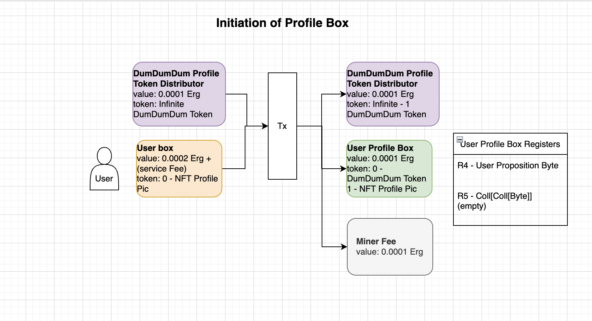

# DumDumDum (Ergo Twitter)

Twitter has been known to be a place where people share a tweet of the length of 120 words. Something succinct where it acts as a form of timestamp of a persons words on the internet.

However, Twitter is a centralized entity, and at the end of the day, what you say are technically controlled by that entity. It begs the questions of the amount of liberty that you truly have with the words you posted. And whether you actually own the words. 

This is where Blockchain and Ergo comes in. With a decentralized system, users can own their own tweet fully. They can decide on whether they’d like to delete it or sell it one day if they want to. And since no one can delete their tweet, this provides a more authentic freedom when it comes to speech.

So let’s begin.

## What makes a tweet, tweet.

To design this system, we have to first understand what a tweet consists of. A tweet is essentially a string of words with a timestamp, that is posted by a certain individual. All of this data is then put online. Sounds a lot like a very familiar component on the blockchain doesn’t it?

To extrapolate this in Blockchain terms.

> A tweet is essentially an NFT that consists of a string of words within its content. And the “Artist Address” is essentially the individual who posted it.
> 

To create twitter on Ergo Blockchain?

Design a tweet protocol.

### But kii, what about the profile photo and the username. That’s the most exciting part.

We’ll have to see what happens with this. Maybe ErgoNames can collaborate and add the username? Who knows. But let’s focus on getting the tweet done.

## EIP 4: Tweet

Lets first declare the asset type.

And also add in the tokens standard

| Register | Description | Example                                                                       | Encoded |
| --- | --- |-------------------------------------------------------------------------------| --- |
| R4 | TweetId | Tweet::ab1239dmajs8t0s1dvhghn29                                               |  |
| R5 | Tweet (UTF-8 representation) | Hi! This is the first tweet                                                   |  |
| R6 | Number of decimals | 0                                                                             |  |
| R7 | NFT-Type | [0x01, 0x05] - i.e., “0e020105”                                               |  |
| R8 | SHA256 hash of the tweet | 19a147aa64ff03489a041f7bc953b3afb7f3916573e5a52f885c3c102893a592              |  |
| R9 | (ActionType, Tweet Id) [Int, Coll[Byte]] | Original Post -> (0, “”), Reply -> (1,  “{BoxId}”), -> Retweet(2, “{BoxId}”) |  |

Now that we have the NFT for the tweet. How can we utilize this?

## Actions

We have to first understand what usages are there in twitter. The first part is the ability to follow someone.

Here’s a few question that we have to answer.

**Q: How are users going to follow other users?
A: After creating a profile. Users can store the addresses that they follow in the profile box**

**Q: What does it mean to create a profile?**

**A: Not having a profile picture or some profile details are kinda boring (like followings). SO, what we’re gonna do is create a contract that allows the storing of profile information on it. For example, nft id so that users can use their nfts as profile photos which is also stored on the chain. ;) A contract will be written to allow users to only use nft photos of the ones that they own, this is done by allowing users to lock their nfts in the profile boxes if they want to use it. Therefore, a profile photo is always a valid NFT that THEY OWN!**

## Profile

The ability to create a box within your own wallet that will not be part of the spending process when you send funds is impossible. (Quite a lot to unpack in that one sentence, English ain’t my first language). This technically stops us from creating profile boxes that we can store in our wallet. Because if we were to do that, we may accidentally spend the profile boxes.

What about creating profile NFTs?
That is a possible solution, however, it can be very meticulous and too much work for the utility that we want to have. Imagine you want to change your profile, and you literally have to burn and mint an NFT every time. Not only that, we would have to create a new NFT protocol, yada yada yada. 

To address this issue, at least for the short term. I’d like to introduce a new design pattern in the eUTxO called a modifiable user box. 

### Modifiable User box

At the end of the day, a profile, is essentially a bunch of information of the user. The user gets to decide what kind of info they’d like to have on their profile, what photo (nft) that they’d like to use in their profile, etc.

To curb this problem, what we have is a contract where only the user can spend it. However, the contract will have additional checks for the registers. This causes boxes that are created at the address to be different from the wallet address. And therefore we can store profile information in a box at the address. This however will pose some other problems, like creating too many profiles in one spot etc. We’ll figure that out as we go.

### Box Design

| Registers | Description | Example |
| --- | --- | --- |
| R4 | User Address | Imagine a random wallet address |
| R5 | Following (Coll[Coll[Byte]]) | [Imagine a random wallet address, and another one, and another one] |

**Value** → MinFee (0.0001 E)

**Tokens**

DumDumDum Profile Token →

id:`07a02cfa15f30a4be5e76eb547b1c612543d25201559cebdc4f6c47d717c2fd5`

amount: 1

**Contract Conditions**

1. Adding/Removing Following
2. Change Profile Picture

**Contract Script**

Profile Token Distribution box

[https://github.com/kii-dot/ergo-twitter-scala/blob/main/conf/contracts/Profile/BoxGuardScripts/ProfileTokenDistributionBox.es](https://github.com/kii-dot/ergo-twitter-scala/blob/main/conf/contracts/Profile/BoxGuardScripts/ProfileTokenDistributionBox.es)

Profile Box

[https://github.com/kii-dot/ergo-twitter-scala/blob/main/conf/contracts/Profile/BoxGuardScripts/ProfileBox.es](https://github.com/kii-dot/ergo-twitter-scala/blob/main/conf/contracts/Profile/BoxGuardScripts/ProfileBox.es)

**Tx Flow**




## UI Design


## API Routes

| Request Type | Route | Function | Body | Implemented |
| --- | --- | --- | --- | --- |
| GET | /feed | get feed | {address: String} | Done |
| GET | /feed/byAddress/{walletAddress} | get address feed | empty | Done |
| POST | /tweet | make a tweet | {message: String, walletAddress: String} | Done |
| POST | /reply | reply to a tweet | {message: String, tweetId: String, walletAddress: String} | Done |
| POST | /retweet | retweet a tweet | {message: String, tweetId: String, walletAddress: String} | Done |
| DELETE | /delete/{tweet_id} | delete a tweet (burn) | empty | Done |
| POST | /profile | create a profile | {nftId: String, address: String} | Done |
| DELETE | /profile | delete a profile | {address: String} | Done |
| PUT | /profile | change profile photo | {nftId: String, address: String} | Done |
| PUT | /follow | follow a wallet address | {addressToFollow: String, walletAddress: String} | Done |
| PUT | /unfollow | unfollow a wallet address | {addressToUnfollow: String, walletAddress: String} | Done |
| GET | /follow/{walletAddress} | get all address that you follow | empty | Done |

## Minting Tx Examples
Minting Tweet:
[Mint Tweet Tx](https://explorer.ergoplatform.com/en/transactions/e3fe602f5f882858fc4f6bc684136f1d7fc130a5c7890eec5578127c9d961577)

Delete Tweet:
[Delete Tweet Tx](https://explorer.ergoplatform.com/en/transactions/24d22c29a11298c95a55f687e5dd321feb6eb4d5d64be203ff7f26564e8e5d85)

Create Profile:
[Create Profile Tx with NFT Locked](https://explorer.ergoplatform.com/en/transactions/419689ed9e48ad7127ab7be5338c913e7060a51c05af6edd4b83416c4936734f)

Add Following Address:
[Add Following Address Tx](https://explorer.ergoplatform.com/en/transactions/7f16deb498621afdc17533c9a93bafa89d811acdd4c92b687b99588def2c270e)

## Utilizing Docker Hub

There are many reasons why Twitter has to have their own servers to host the site and for us to call their servers to utilize the app. However, we can negate all of that, just by introducing blockchain into the play. 

One of the reason why Twitter needs to host the website is due to the immense centralized data that they have. However, by utilizing Ergo Blockchain as the “database” for our decentralized twitter app, users do not need to depend on a centralized server. Instead, they can download an executable or in our case, clone the repo, and use the docker container to host the server on their own machine.

Therefore the usage of Docker Containers in this app will allow decentralization of our twitter app to its finest possibility. An entirely decentralized application with no dependencies of a centralized server at all.

You can do that by cloning this [repo](https://github.com/kii-dot/ergo-twitter) and run

```bash
docker compose up
```

or if you want the exact commands for cloning and running it

```bash
git clone https://github.com/kii-dot/ergo-twitter
cd ergo-twitter
docker compose up
```

now head to [localhost:9000](http://localhost:9000) and see the magic works 

## Progress Photos

Getting feed via address (all of these are minted NFTs)


Tweet signs


Get Following


## To-do list

- [x]  Documentation

### Backend

- [x]  Routes
- [x]  Mint NFTs Backend
- [x]  Burn NFT Backend ([tx](https://explorer.ergoplatform.com/en/transactions/24d22c29a11298c95a55f687e5dd321feb6eb4d5d64be203ff7f26564e8e5d85))
- [x]  Address Feed
- [x]  Feed
- [x]  Following implementation in Profile Box
- [x]  Profile Box Design
- [x]  Profile Box Contracts
- [x]  Profile Box Backend
- [ ]  Publish Required Package (Issue with signing on machine. Can't publish.)
- [ ]  Dockerized App (Need to have above packaged to be published in SONAType to be able to dockerize. However the docker files have been written)
- [ ]  Front end
    - [ ]  Command Prompt App to sign Txs
    
    OR
    
    - [ ]  UI Webpage

### Profile

- [x]  mint DumDumDum Tokens
- [x]  mint DumDumDum ProfileBox NFT Token
- [x]  Put it into DumDumDum Profile Box Address
- [x]  Write Profile Box Wrapper
- [x]  Write Profile Box Txs
    - [x]  Initiation
    - [x]  Change of details
    - [x]  deleting
    - [x]  follower
- [x]  Get Profile call
- [x]  Get Follower Call

### Front-end (Not working on during this hackathon)

- [ ]  UI Components
- [ ]  UI Page
- [ ]  UI wallet connect
- [ ]  Tweetable


## Next Step
The current code is usable if you can use ergo_config.json to sign txs. However this app is designed to be called as an api. Therefore it needs to be implemented with a front end where nautilus can sign the reduced txs. The skills to develop that has not been attained by the current developer, and therefore this will be a work in progress. However! There is a mock web ui that was semi built, and this is a screen shot.


Next step for real for real:
1. Publish Package
2. Dockerize app
3. Build a command line to sign Tx so that users can start using
4. Build downloadable frontend UI